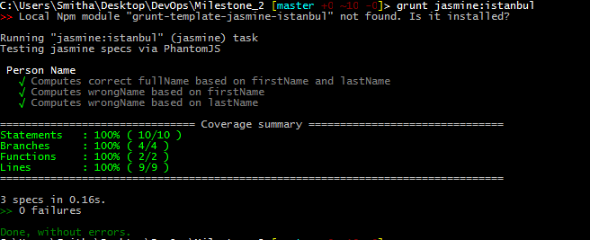
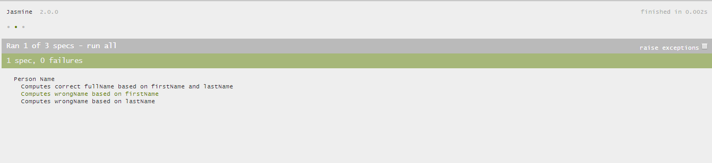

MILESTONE 2 - CSC591 DevOps
-------------------------------

Project Team Members:

1] Priyanka Shankaran (priyan)

2] Smitha Sathyanarayana (ssathya)

### Test Section
-------------------------------

**Step 1: The ability to run unit tests, measure coverage, and report the results.**

**Step 2: The ability to improve testing coverage using one of the techniques covered in class: constraint-based test generation, fuzzing, etc. You can use an existing tool or implement your own approach.**

### Analysis Section
---------------------------
**Step 3: The ability to run an existing static analysis tool on the source code (e.g. FindBugs, PMD, CheckStyle, NCover, Lint, etc.), process its results, and report its findings.**

1] For this step, we have used jshint to run a static analysis on the source code. The grunt task to run jshint has been integrated on the Gruntfile as can be seen below. The task also specifies the names of the file that jshint has to run static analysis on. Additionally, the task also includes the command to report the findings of jshint to an xml file.

2] Now when we run the grunt task on the source code, we can see that the task was aborted due to warnings generated by the code. These warnings can be seen in more detail in the reporter file which is explained in the next step.

3] The screenshot below renders the contents of the file 'report-jshint-checkstyle.xml'. This file displays the exact number of errors, with their details, and also specifies which file they are present in.

**Step 4: The ability to extend an existing analysis tool with a custom rule, or implement a new analysis. For example, you could write a static analysis that checks for the ratio of comments to code, or finds parse errors in SQL string statements. You could introduce security checks, a dynamic analysis, a data-flow analysis or a data-flow based test coverage.**

1] Esprima was used in order to analyse different code statements and their properties. For example, maximum depth of nested loops, mean and maximum parameters taken by functions in the code have been computed and displayed.

2] As can been seen from the screenshot below, we have run the analysis on the test.js file to check through the statements and return the properties of the test.js file as needed.

**Step 5: The ability to reject a commit if it fails a minimum testing criteria (e.g. failed test case, or less than 50% statement coverage) and analysis criteria (e.g. cannot commits that generate a particular FindBugs rule, such as "Method concatenates strings using + in a loop").**

 